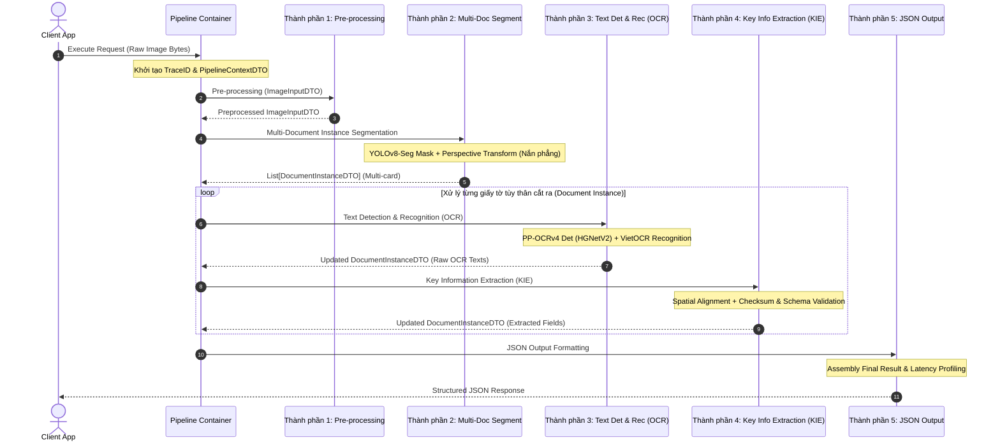
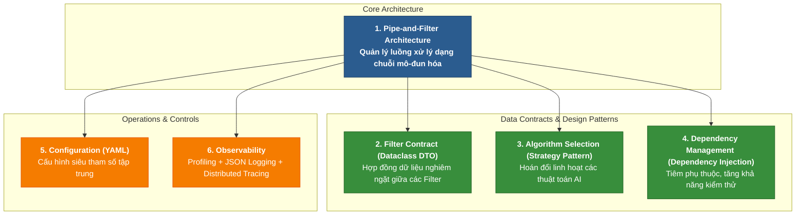
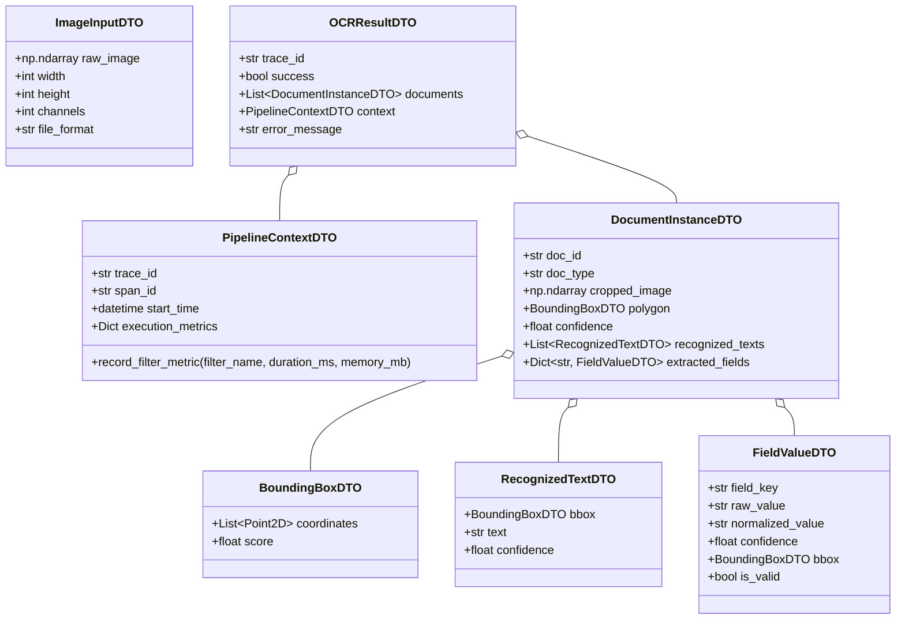
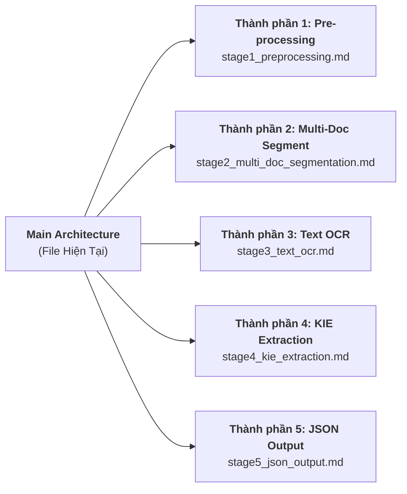

# HỆ THỐNG OCR GIẤY TỜ TÙY THÂN: THIẾT KẾ KIẾN TRÚC & WORKFLOW PIPELINE
*(OCR PIPELINE ARCHITECTURE & WORKFLOW SPECIFICATION)*

---

## 1. TỔNG QUAN VỀ HỆ THỐNG & WORKFLOW PIPELINE

### 1.1. Mục Tiêu Hệ Thống
Hệ thống **OCR Giấy tờ Tùy thân (Identity Document OCR System)** được xây dựng để xử lý tự động, phát hiện, phân đoạn và trích xuất dữ liệu từ các loại giấy tờ tùy thân (Căn cước công dân - CCCD, Hộ chiếu - Passport, Giấy phép lái xe - GPLX).

Đặc thù cốt lõi của hệ thống là xử lý **Đa giấy tờ trong một ảnh (Multi-document / Multi-card processing)**. Khi ảnh nhận vào chứa 2 hoặc nhiều giấy tờ (ví dụ: chụp cả mặt trước CCCD và Passport cùng lúc), hệ thống tự động bóc tách từng giấy tờ độc lập, nắn phẳng góc nhìn (Perspective Transform), nhận diện văn bản tiếng Việt và bóc tách dữ liệu chuẩn đầu ra dạng **JSON**.

---

### 1.2. Biểu Đồ Trình Tự Workflow Tổng Quan (Sequence Diagram)



---

## 2. QUY TẮC THIẾT KẾ & TIÊU CHUẨN KIẾN TRÚC (DESIGN PRINCIPLES)

Toàn bộ hệ thống phải tuân thủ nghiêm ngặt 6 tiêu chuẩn kiến trúc cốt lõi dưới đây:



---

### 2.1. Pipe-and-Filter Architecture
- Chuỗi xử lý được chia nhỏ thành các **Filter** hoàn toàn độc lập, nhận dữ liệu đầu vào qua Pipe, thực hiện tính toán và truyền sang Filter tiếp theo.
- Giúp dễ dàng mở rộng, thay đổi thứ tự filter, hoặc thêm các filter mới mà không làm phá vỡ logic hiện tại.

---

### 2.2. Filter Contract (Dataclass DTO)
Mọi dữ liệu trao đổi giữa các Filter bắt buộc tuân thủ hợp đồng dạng Python `@dataclass` DTO (Data Transfer Object) để đảm bảo an toàn kiểu dữ liệu (Type Safety) và chống trôi kiểu (Type Drift).



---

### 2.3. Algorithm Selection (Strategy Pattern)
Tất cả các thuật toán AI (Segmentation, Text Detection, Text Recognition, Information Extraction) phải được đóng gói đằng sau các giao diện (Interfaces) chuẩn, cho phép hoán đổi thuật toán linh hoạt thông qua cấu hình.

```mermaid
classDiagram
    class ISegmentationStrategy {
        <<interface>>
        +segment_multi_documents(image: np.ndarray) List~DocumentInstanceDTO~
    }

    class ITextDetectionStrategy {
        <<interface>>
        +detect_text_regions(crop_image: np.ndarray) List~BoundingBoxDTO~
    }

    class ITextRecognitionStrategy {
        <<interface>>
        +recognize_text(crop_image: np.ndarray, bboxes: List~BoundingBoxDTO~) List~RecognizedTextDTO~
    }

    class IFieldExtractionStrategy {
        <<interface>>
        +extract_fields(doc_type: str, ocr_texts: List~RecognizedTextDTO~) Dict~str, FieldValueDTO~
    }

    class YOLOv8SegmentationStrategy {
        +segment_multi_documents(image: np.ndarray) List~DocumentInstanceDTO~
    }
    class PPOCRv4DetStrategy {
        +detect_text_regions(crop_image: np.ndarray) List~BoundingBoxDTO~
    }
    class VietOCRRecognitionStrategy {
        +recognize_text(crop_image: np.ndarray, bboxes: List~BoundingBoxDTO~) List~RecognizedTextDTO~
    }
    class LayoutRegexExtractionStrategy {
        +extract_fields(doc_type: str, ocr_texts: List~RecognizedTextDTO~) Dict~str, FieldValueDTO~
    }

    ISegmentationStrategy <|.. YOLOv8SegmentationStrategy
    ITextDetectionStrategy <|.. PPOCRv4DetStrategy
    ITextRecognitionStrategy <|.. VietOCRRecognitionStrategy
    IFieldExtractionStrategy <|.. LayoutRegexExtractionStrategy
```



---

### 2.4. Dependency Management (Dependency Injection)
- Sử dụng nguyên lý Inversion of Control (IoC). Tất cả các Strategy, Logger, Profiler được "tiêm" (Inject) vào Constructor của các Filter và Container.
- Tối ưu hóa cho Unit Testing và Integration Testing bằng cách dễ dàng Mocking các mô hình AI đắt đỏ.

---

### 2.5. Configuration (YAML)
Tập trung toàn bộ siêu tham số (Hyperparameters), đường dẫn weights, confidence thresholds, hardware execution provider (`cuda:0` / `cpu`) vào file `pipeline_config.yaml`:

```yaml
pipeline:
  name: "MultiDoc_OCR_Pipeline"
  version: "2.1.0"
  device: "cuda:0"

tracing:
  enabled: true
  service_name: "ocr-pipeline-service"

filters:
  segmentation:
    strategy: "YOLOv8SegStrategy"
    confidence_threshold: 0.65
  text_detection:
    strategy: "PPOCRv4DetStrategy"   # PP-OCRv4 Det (Backbone PPHGNetV2 / PPLCNetV3)
    backbone: "PPHGNetV2"
  text_recognition:
    strategy: "VietOCRRecognitionStrategy"
  information_extraction:
    strategy: "LayoutRegexExtractionStrategy"
```

---

### 2.6. Observability (Profiling + Logging + Tracing)
- **Profiling**: Đo đạc độ trễ thời gian thực thi (Latency Profiler tính bằng ms) và mức tiêu thụ tài nguyên (RAM/GPU Memory) của từng Filter.
- **Logging**: Ghi log cấu trúc dạng JSON Lines (Loguru / structlog) phục vụ phân tích log tập trung (ELK Stack / Loki).
- **Tracing**: Gán `TraceID` (UUID v4) cho mỗi request và `SpanID` cho từng Filter để truy vết toàn bộ luồng xử lý.

---

## 3. CHI TIẾT 5 THÀNH PHẦN PIPELINE (PIPELINE STAGES DOCS LINKING)

Workflow của Pipeline được chia thành **5 Thành phần chính**. Bấm vào các liên kết bên dưới để tới tài liệu chi tiết của từng thành phần:



### Bảng Danh Sách Tài Liệu 5 Thành Phần Pipeline:

| STT | Thành phần Pipeline | Tài Liệu Chi Tiết (Click để xem) | Mô Tả Nội Dung |
|:---:|:--- |:--- |:--- |
| 1 | **Thành phần 1** | [🛠️ Pre-processing (Tiền xử lý)](./stage1_preprocessing.md) | Gán TraceID, kiểm tra định dạng ảnh, xoay ảnh tự động, khử nhiễu & CLAHE |
| 2 | **Thành phần 2** | [✂️ Multi-Document Instance Segmentation](./stage2_multi_doc_segmentation.md) | YOLOv8-Seg mask, xác định 4 góc polygon, nắn phẳng góc nhìn (Perspective Transform) |
| 3 | **Thành phần 3** | [🔍 Text Detection & Recognition - OCR](./stage3_text_ocr.md) | PP-OCRv4 Det (HGNetV2/LCNet) & VietOCR nhận diện chữ trên CCCD/Passport |
| 4 | **Thành phần 4** | [🧠 Key Information Extraction - KIE](./stage4_kie_extraction.md) | Spatial layout alignment, Regex Checksum CCCD/Passport & chuẩn hóa địa danh |
| 5 | **Thành phần 5** | [📦 JSON Output Formatting](./stage5_json_output.md) | Xuất dữ liệu cấu trúc JSON tiêu chuẩn kèm thông số Profiling & Trace ID |
