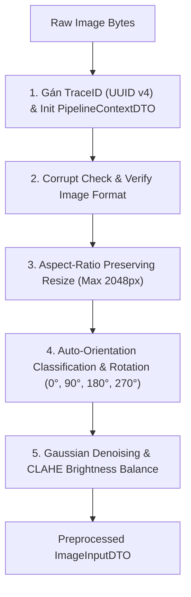

# THÀNH PHẦN 1: PRE-PROCESSING (TIỀN XỬ LÝ ẢNH)

[⬅️ Quay lại Tài liệu chính OCR Pipeline Architecture](./OCR_Pipeline_Architecture.md)

---

## 1. TỔNG QUAN THÀNH PHẦN

**Pre-processing Filter** là thành phần đầu tiên trong Pipeline xử lý. Thành phần này có nhiệm vụ tiếp nhận dữ liệu ảnh thô từ phía Client, khởi tạo ngữ cảnh truy vết (Tracing Context), kiểm tra tính hợp lệ và thực hiện các kỹ thuật xử lý ảnh cơ bản để chuẩn hóa chất lượng ảnh trước khi đưa vào mô hình Deep Learning ở giai đoạn sau.

---

## 2. QUY TRÌNH XỬ LÝ CHI TIẾT

### Chi Tiết Từng Bước Thực Thi:
1. **Khởi Tạo Tracing**: Tạo `TraceID` (UUID v4) duy nhất gắn kèm vào `PipelineContextDTO` để phục vụ Distributed Tracing xuyên suốt toàn bộ luồng xử lý.
2. **Kiểm Tra Tính Hợp Lệ (Corrupt Check)**: Đọc ma trận ảnh bằng OpenCV (`cv2.imdecode`), kiểm tra nếu mảng ảnh rỗng (`None`) hoặc bị lỗi nén sẽ báo lỗi ngay lập tức.
3. **Chuẩn Hóa Kích Thước (Resize)**: Nếu chiều rộng hoặc chiều cao ảnh vượt quá `max_image_dimension` (cấu hình trong `pipeline_config.yaml`, mặc định 2048px), ảnh sẽ được thu nhỏ giữ nguyên tỷ lệ khung hình (Aspect Ratio) để tối ưu tốc độ tính toán.
4. **Xoay Ảnh Tự Động (Auto-Orientation)**: Sử dụng mô hình phân loại hướng ảnh (Orientation Classifier) để đưa ảnh về đúng chiều thẳng đứng người đọc.
5. **Cân Bằng Độ Sáng (CLAHE)**: Sử dụng thuật toán CLAHE (Contrast Limited Adaptive Histogram Equalization) để cân bằng độ sáng vùng tối/sáng bất thường trên bề mặt giấy tờ tùy thân.

---

## 3. THÔNG SỐ ĐẦU VÀO & ĐẦU RA (DTO CONTRACT)

- **Đầu vào (Input)**: `ImageInputDTO` (ảnh thô dạng bytes hoặc ma trận OpenCV)
- **Đầu ra (Output)**: `ImageInputDTO` (ảnh đã qua xử lý chuẩn hóa)
- **Context Metrics**: Ghi nhận `duration_ms` thực thi vào `PipelineContextDTO`.

---

[⬅️ Quay lại Tài liệu chính OCR Pipeline Architecture](./OCR_Pipeline_Architecture.md)
