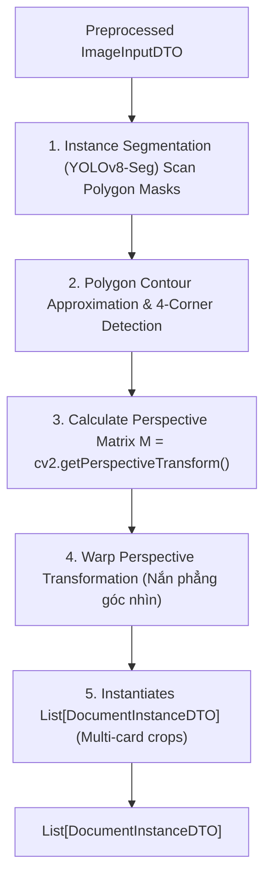

# THÀNH PHẦN 2: MULTI-DOCUMENT INSTANCE SEGMENTATION (PHÂN ĐOẠN ĐA GIẤY TỜ TÙY THÂN)

[⬅️ Quay lại Tài liệu chính OCR Pipeline Architecture](./OCR_Pipeline_Architecture.md)

---

## 1. TỔNG QUAN THÀNH PHẦN

**Multi-Document Instance Segmentation Filter** giải quyết bài toán đặc thù quan trọng của hệ thống: **Một ảnh chụp chứa nhiều giấy tờ tùy thân** (ví dụ: chụp đồng thời 2 mặt trước/sau CCCD, hoặc mặt trước CCCD cùng Hộ chiếu).

> [!IMPORTANT]
> **Quy tắc thiết kế cốt lõi**: Mô hình phân đoạn (Segmentation Model) chỉ thực hiện nhiệm vụ duy nhất là **phát hiện và phân đoạn vùng pixel chứa thẻ (Class-Agnostic / Single-Class `card`)**, hoàn toàn **không thực hiện phân loại (Classification)** loại giấy tờ (như `CCCD_FRONT`, `PASSPORT`, v.v.). Việc phân loại loại giấy tờ sẽ được đảm nhận ở các bước sau (OCR hoặc bộ phân loại chuyên biệt) nhằm đảm bảo mô hình phân đoạn đạt độ tổng quát hóa tối đa cho mọi loại thẻ.

Thành phần này phát hiện chính xác vùng Polygon của tất cả giấy tờ có trong ảnh, sau đó áp dụng thuật toán **Perspective Transform (Warp Perspective)** để nắn phẳng từng giấy tờ nghiêng/méo thành ảnh hình chữ nhật phẳng chuẩn.

---

## 2. QUY TRÌNH XỬ LÝ CHI TIẾT

### Chi Tiết Từng Bước Thực Thi:

1. **Instance Segmentation**: Đưa ảnh tiền xử lý qua mô hình Deep Learning YOLOv8-Seg để dự đoán mask và bounding box cho từng vật thể giấy tờ.
2. **Xác Định 4 Góc Polygon**: Tìm 4 điểm góc cực (Top-Left, Top-Right, Bottom-Right, Bottom-Left) của viền giấy tờ bằng thuật toán Polygon Contour Approximation.
3. **Tính Ma Trận Biến Đổi Góc Nhìn**: Tính toán Ma trận biến đổi $M$:
   $$
   M = \text{cv2.getPerspectiveTransform}(\text{src\_corners}, \text{dst\_corners})
   $$

   Trong đó `dst_corners` là khung hình chữ nhật chuẩn tương ứng với kích thước tiêu chuẩn thực tế của loại giấy tờ đó (ví dụ: CCCD chuẩn tỉ lệ 85.6mm x 53.98mm).
4. **Nắn Phẳng (Warp Perspective)**: Áp dụng $\text{cv2.warpPerspective}(\text{image}, M, (\text{width}, \text{height}))$ để cắt và duỗi phẳng vùng ảnh giấy tờ.
5. **Khởi Tạo Danh Sách Giấy Tờ**: Đóng gói các ảnh nắn phẳng thu được thành danh sách các đối tượng `DocumentInstanceDTO`.

---

## 3. MINH HỌA THỰC TẾ (DEMO IMPLEMENTATION)

### Phân Đoạn & Duỗi Phẳng Trang Thông Tin Hộ Chiếu (Passport Segmentation Demo):

Ảnh minh họa dưới đây thể hiện thuật toán Segmentation bao khoanh đường viền Polygon màu tím hồng ôm sát bề mặt Hộ chiếu, loại bỏ hoàn toàn phần phông nền phía sau và nắn phẳng trước khi chuyển sang bước OCR:

*(Minh họa đường viền Polygon Hộ chiếu được phân đoạn và duỗi phẳng góc nhìn)*

---

## 4. THÔNG SỐ ĐẦU VÀO & ĐẦU RA (DTO CONTRACT)

- **Đầu vào (Input)**: `ImageInputDTO`
- **Đầu ra (Output)**: `List[DocumentInstanceDTO]` (mỗi phần tử chứa ảnh crop đã nắn phẳng, loại giấy tờ, confidence score và polygon ban đầu)
- **Context Metrics**: Ghi nhận `duration_ms` thực thi vào `PipelineContextDTO`.

---

## 5. QUÁ TRÌNH HUẤN LUYỆN MODEL & DỮ LIỆU (MODEL TRAINING & DATASET)

Thành phần phân đoạn ảnh giấy tờ sử dụng mô hình học sâu Instance Segmentation được huấn luyện dựa trên bộ dữ liệu và cấu hình chi tiết dưới đây:

### 5.1. Dữ liệu Huấn Luyện (Dataset)

- **Nguồn dữ liệu**: Bộ dữ liệu được lưu trữ và quản lý trực tiếp trên nền tảng **Roboflow**.
  - **Workspace**: `loganqin`
  - **Project**: `id-card-8apvj` (Phiên bản v1)
  - **Tên thư mục lưu cục bộ**: `data/raw/ID-card-1`
- **Định dạng dữ liệu**: Định dạng nhãn Polygon phân đoạn đối tượng tương thích với YOLOv8/YOLOv11/YOLO26 (`yolo26` format).
- **Cấu trúc phân mục**:
  - `train/images/` & `train/labels/`: Tập ảnh và nhãn dùng cho huấn luyện.
  - `val/images/` & `val/labels/`: Tập ảnh và nhãn dùng cho kiểm thử và đánh giá (Validation).

### 5.2. Kiến Trúc Model & Tham Số Huấn Luyện

- **Kiến trúc mạng (Model Architecture)**: Sử dụng mô hình phân đoạn thực thể **YOLO26m-seg** (hoặc bản siêu nhẹ **YOLO26n-seg**) cho hiệu năng tối ưu trên GPU di động và máy tính xách tay.
- **Tham số cấu hình chính (Training Hyperparameters)**:
  - **Kích thước ảnh đầu vào (Input Size)**: `640x640` pixel (sử dụng kỹ thuật letterbox tự động để bảo toàn tỷ lệ).
  - **Kích thước batch (Batch size)**: `16`.
  - **Tổng số epoch tối đa**: `100` epoch (tích hợp cơ chế dừng sớm `patience=50` để chống overfitting).
  - **Đóng Mosaic Augmentation**: Hệ thống tự động vô hiệu hóa chế độ Mosaic ở `10` epoch cuối (từ epoch 91 đến 100) để mô hình hội tụ trên phân phối ảnh thực tế sạch.
  - **Giám sát chất lượng (Validation Fitness)**:
    $$
    \text{Fitness} = 0.1 \times \text{mAP50(Box)} + 0.9 \times \text{mAP50-95(Box)} + 0.1 \times \text{mAP50(Mask)} + 0.9 \times \text{mAP50-95(Mask)}
    $$

### 5.3. Phân Tích Hiệu Năng & Khắc Phục Lỗi Hệ Thống (EDA & Model Improvement)

Qua phân tích thực tế từ tệp [results.csv](<file:///c:/Users/Admin/HUIT%20-%20H%E1%BB%8Dc%20T%E1%BA%ADp/N%C4%83m%203/DocU/model/segmentation/yolo26_seg/results.csv>):

- **Hiện tượng**: Chỉ số đánh giá tập Validation đạt kết quả cực kỳ cao (mAP50-95 đạt ~98%), tuy nhiên khi áp dụng thực tế trên các bức ảnh có ngón tay đè lên thẻ (occlusion) hoặc phông nền phức tạp (ví dụ: lá cây, ngoại cảnh), mô hình vẫn gặp lỗi lẹm viền hoặc nhận diện nhầm nền.
- **Nguyên nhân**: Sự lệch phân phối dữ liệu (Domain Shift) và hiện tượng rò rỉ dữ liệu (Data Leakage) khi chia tập ngẫu nhiên đối với các ảnh trùng lặp trong bộ dữ liệu gốc.
- **Giải pháp tối ưu hóa đang áp dụng & đề xuất**:
  1. **Đơn giản hóa nhãn (Class-Agnostic)**: Chuyển toàn bộ các lớp nhãn đặc thù (`CHIP_FRONT`, `CHIP_BACK`, v.v.) về một lớp chung duy nhất là `card`. Việc nhận diện phân loại thẻ sẽ được gác lại cho bộ lọc OCR hoặc Classifier chuyên biệt ở giai đoạn sau. Điều này giúp mô hình chỉ tập trung học biên dạng hình học của "tấm thẻ".
  2. **Bổ sung Background âm tính**: Thêm 10% - 15% ảnh ngoại cảnh (lá cây, mặt bàn trống) không chứa thẻ và không gán nhãn vào tập train để hạn chế nhiễu đốm xanh lá.
  3. **Chuẩn hóa quy trình dán nhãn**: Yêu cầu nhãn vẽ khuyết biên tránh ngón tay một cách đồng bộ để mô hình học được ranh giới rõ ràng giữa da tay và mép thẻ.

---

[⬅️ Quay lại Tài liệu chính OCR Pipeline Architecture](./OCR_Pipeline_Architecture.md)
