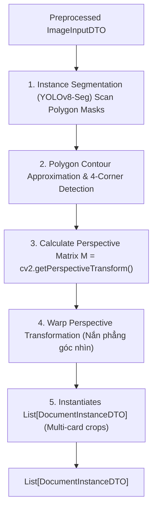

# THÀNH PHẦN 2: MULTI-DOCUMENT INSTANCE SEGMENTATION (PHÂN ĐOẠN ĐA GIẤY TỜ TÙY THÂN)

[⬅️ Quay lại Tài liệu chính OCR Pipeline Architecture](./OCR_Pipeline_Architecture.md)

---

## 1. TỔNG QUAN THÀNH PHẦN

**Multi-Document Instance Segmentation Filter** giải quyết bài toán đặc thù quan trọng của hệ thống: **Một ảnh chụp chứa nhiều giấy tờ tùy thân** (ví dụ: chụp đồng thời 2 mặt trước/sau CCCD, hoặc mặt trước CCCD cùng Hộ chiếu).

Thành phần này phát hiện chính xác vùng Polygon của tất cả giấy tờ có trong ảnh, phân loại loại giấy tờ (`CCCD_FRONT`, `PASSPORT`, v.v.), sau đó áp dụng thuật toán **Perspective Transform (Warp Perspective)** để nắn phẳng từng giấy tờ nghiêng/méo thành ảnh hình chữ nhật phẳng chuẩn.

---

## 2. QUY TRÌNH XỬ LÝ CHI TIẾT

### Chi Tiết Từng Bước Thực Thi:
1. **Instance Segmentation**: Đưa ảnh tiền xử lý qua mô hình Deep Learning YOLOv8-Seg để dự đoán mask và bounding box cho từng vật thể giấy tờ.
2. **Xác Định 4 Góc Polygon**: Tìm 4 điểm góc cực (Top-Left, Top-Right, Bottom-Right, Bottom-Left) của viền giấy tờ bằng thuật toán Polygon Contour Approximation.
3. **Tính Ma Trận Biến Đổi Góc Nhìn**: Tính toán Ma trận biến đổi $M$:
   $$M = \text{cv2.getPerspectiveTransform}(\text{src\_corners}, \text{dst\_corners})$$
   Trong đó `dst_corners` là khung hình chữ nhật chuẩn tương ứng với kích thước tiêu chuẩn thực tế của loại giấy tờ đó (ví dụ: CCCD chuẩn tỉ lệ 85.6mm x 53.98mm).
4. **Nắn Phẳng (Warp Perspective)**: Áp dụng $\text{cv2.warpPerspective}(\text{image}, M, (\text{width}, \text{height}))$ để cắt và duỗi phẳng vùng ảnh giấy tờ.
5. **Khởi Tạo Danh Sách Giấy Tờ**: Đóng gói các ảnh nắn phẳng thu được thành danh sách các đối tượng `DocumentInstanceDTO`.

---

## 3. MINH HỌA THỰC TẾ (DEMO IMPLEMENTATION)

### Phân Đoạn & Duỗi Phẳng Trang Thông Tin Hộ Chiếu (Passport Segmentation Demo):
Ảnh minh họa dưới đây thể hiện thuật toán Segmentation bao khoanh đường viền Polygon màu tím hồng ôm sát bề mặt Hộ chiếu, loại bỏ hoàn toàn phần phông nền phía sau và nắn phẳng trước khi chuyển sang bước OCR:

  
*(Minh họa đường viền Polygon Hộ chiếu được phân đoạn và duỗi phẳng góc nhìn)*

---

## 4. THÔNG SỐ ĐẦU VÀO & ĐẦU RA (DTO CONTRACT)

- **Đầu vào (Input)**: `ImageInputDTO`
- **Đầu ra (Output)**: `List[DocumentInstanceDTO]` (mỗi phần tử chứa ảnh crop đã nắn phẳng, loại giấy tờ, confidence score và polygon ban đầu)
- **Context Metrics**: Ghi nhận `duration_ms` thực thi vào `PipelineContextDTO`.

---

[⬅️ Quay lại Tài liệu chính OCR Pipeline Architecture](./OCR_Pipeline_Architecture.md)
