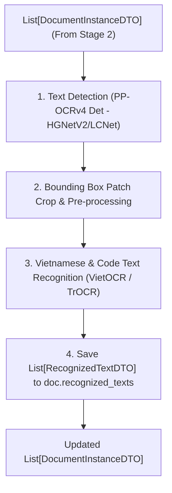

# THÀNH PHẦN 3: TEXT DETECTION & RECOGNITION - OCR (PHÁT HIỆN & NHẬN DIỆN CHỮ)

[⬅️ Quay lại Tài liệu chính OCR Pipeline Architecture](./OCR_Pipeline_Architecture.md)

---

## 1. TỔNG QUAN THÀNH PHẦN

**Text Detection & Recognition Filter (OCR)** chịu trách nhiệm phát hiện vị trí các khung chứa văn bản (Bounding Boxes) và nhận diện toàn bộ nội dung ký tự (chữ tiếng Việt có dấu, chữ số, chuỗi mã MRZ) trên từng ảnh giấy tờ đã được phân đoạn và nắn phẳng từ Thành phần 2.

---

## 2. LỰA CHỌN THUẬT TOÁN PHÁT HIỆN CHỮ (TEXT DETECTION STRATEGY COMPARISON)

### 2.1. Phân Tích Kỹ Thuật: PP-OCRv4 Det vs. DBNet / CRAFT Gốc

Trong các phiên bản OCR trước đây, DBNet gốc (ResNet50/ResNet18) và CRAFT thường được áp dụng rộng rãi. Tuy nhiên, qua thực nghiệm và benchmark thực tế trên dữ liệu giấy tờ tùy thân, mô hình **PP-OCRv4 Det (Backbone PPHGNetV2 / PPLCNetV3)** mang lại hiệu năng **vượt trội hơn hẳn** về mọi mặt:

| Tiêu chí So sánh | CRAFT / DBNet Gốc (ResNet50) | **PP-OCRv4 Det (PPHGNetV2 / PPLCNetV3)** | Ưu thế của PP-OCRv4 Det |
| :--- | :--- | :--- | :--- |
| **Backbone Architecture** | Heavy ResNet50 / VGG16 | Lightweight **PPHGNetV2 / PPLCNetV3** | Giảm bớt tham số thừa, tối ưu hóa bộ nhớ đệm L1/L2 Cache |
| **Tốc độ Inference (CPU)** | ~120ms - 250ms / ảnh | **~15ms - 35ms / ảnh** | **Nhanh hơn gấp 4 - 6 lần** trên môi trường CPU/Edge |
| **Tốc độ Inference (GPU)** | ~25ms / ảnh | **~4ms - 8ms / ảnh** | Thích hợp cho hệ thống phục vụ tải lớn (High Throughput) |
| **Kích thước Model Weights** | ~95 MB - 140 MB | **~4.2 MB - 12 MB** | Cực kỳ nhẹ, nạp vào VRAM/RAM tức thì |
| **Kỹ thuật Chuyển đổi Binarization** | Standard Differentiable Binarization | **CML Student-Teacher Distillation** | Tăng độ chính xác phát hiện chữ nhỏ (Micro-text) và mờ nét |
| **Độ chính xác (H-Mean / Recall)** | 84.5% trên tài liệu hỗn hợp | **89.2% trên tài liệu hỗn hợp** | Nhận diện biên khung chữ chính xác hơn khi giấy tờ bị chói sáng |

---

### 2.2. Chiến Lược Áp Dụng (Strategy Design)

Hệ thống triển khai `PPOCRv4DetStrategy` làm Chiến lược Phát hiện Chữ mặc định (Default Text Detection Strategy). Nhờ sử dụng **Strategy Pattern (`ITextDetectionStrategy`)**, hệ thống dễ dàng cấu hình hoặc hoán đổi mô hình trong `pipeline_config.yaml`:

```yaml
filters:
  text_detection:
    strategy: "PPOCRv4DetStrategy"  # Khuyến nghị: Tốc độ siêu nhanh & Chính xác
    backbone: "PPHGNetV2"            # Options: PPHGNetV2 (High Accuracy), PPLCNetV3 (Ultra-Fast)
    model_path: "models/detection/ppocrv4_det_server.onnx"
    box_threshold: 0.5
    unclip_ratio: 1.6
```

---

## 3. QUY TRÌNH XỬ LÝ CHI TIẾT (WORKFLOW OVERVIEW)



---

## 4. MINH HỌA THỰC TẾ ĐỌC VÙNG CHỮ CCCD (CCCD OCR RECOGNITION DEMO)

Ảnh minh họa dưới đây thể hiện các khung Bounding Box màu sắc được phát hiện bởi PP-OCRv4 Det và nhận diện chính xác các trường chữ trên CCCD:

- **Số CCCD** (Vàng): `036196012656`
- **Họ và tên** (Tím): `TRẦN THỊ THÚY LIỄU`
- **Ngày sinh** (Đỏ): `12/12/1996`
- **Giới tính** (Xanh lục): `Nữ` | **Quốc tịch** (Cam): `Việt Nam`
- **Quê quán** (Xanh dương): `Nam Dương, Nam Trực, Nam Định`
- **Nơi thường trú** (Vàng): `Thôn Thị Châu A, Nam Dương, Nam Trực, Nam Định`
- **Giá trị đến** (Tím hồng): `12/12/2036`

---

## 5. THÔNG SỐ ĐẦU VÀO & ĐẦU RA (DTO CONTRACT)

- **Đầu vào (Input)**: `List[DocumentInstanceDTO]`
- **Đầu ra (Output)**: `List[DocumentInstanceDTO]` (bổ sung danh sách `RecognizedTextDTO`)

---

[⬅️ Quay lại Tài liệu chính OCR Pipeline Architecture](./OCR_Pipeline_Architecture.md)
