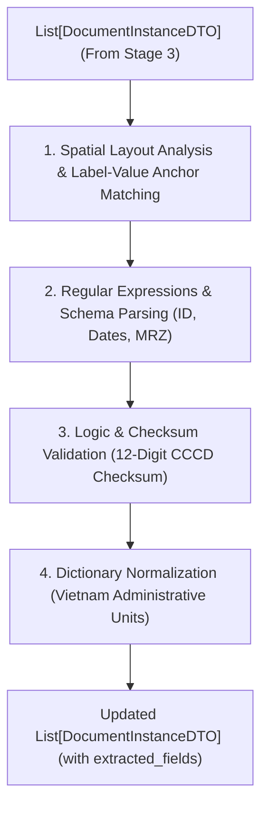

# THÀNH PHẦN 4: KEY INFORMATION EXTRACTION - KIE (TRÍCH XUẤT THÔNG TIN TRỌNG YẾU & VALIDATE)

[⬅️ Quay lại Tài liệu chính OCR Pipeline Architecture](./OCR_Pipeline_Architecture.md)

---

## 1. TỔNG QUAN THÀNH PHẦN

**Key Information Extraction Filter (KIE)** chịu trách nhiệm chuyển đổi từ danh sách các đoạn văn bản thô (Unstructured OCR Texts) thu được ở Thành phần 3 thành dữ liệu có cấu trúc Key-Value có ý nghĩa nghiệp vụ (ví dụ: bóc tách chính xác đâu là Số CCCD, Họ tên, Ngày sinh, Địa chỉ).

Đồng thời, thành phần này thực hiện các quy tắc logic nghiệp vụ như: kiểm tra Checksum 12 số CCCD, format ngày tháng chuẩn ISO `YYYY-MM-DD`, giải mã 2 dòng mã MRZ Hộ chiếu và chuẩn hóa tên tỉnh/huyện/xã từ Từ điển Hành chính Việt Nam.

---

## 2. QUY TRÌNH XỬ LÝ CHI TIẾT (WORKFLOW OVERVIEW)

---

## 3. NỘI DUNG CHI TIẾT TRIỂN KHAI (USER SPECIFICATIONS PLACEHOLDER)

> [!NOTE]
> *Nội dung thông số chi tiết của Thành phần 4 (KIE Rules, Layout Schema, Logic Checks) đang được cập nhật bổ sung theo thông tin triển khai cụ thể từ phía người dùng.*

- **Layout Matching Rules**: *(Chờ bổ sung...)*
- **Regex Patterns & Normalization Dictionary**: *(Chờ bổ sung...)*

---

## 4. THÔNG SỐ ĐẦU VÀO & ĐẦU RA (DTO CONTRACT)

- **Đầu vào (Input)**: `List[DocumentInstanceDTO]`
- **Đầu ra (Output)**: `List[DocumentInstanceDTO]` (bổ sung từ điển `extracted_fields`)

---

[⬅️ Quay lại Tài liệu chính OCR Pipeline Architecture](./OCR_Pipeline_Architecture.md)
