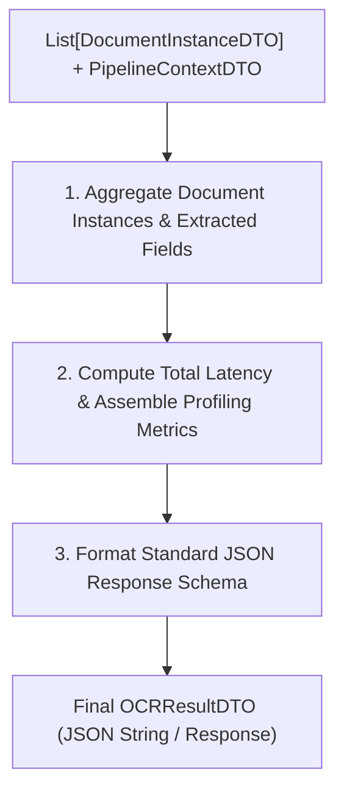

# THÀNH PHẦN 5: JSON OUTPUT FORMATTING (XUẤT KẾT QUẢ JSON)

[⬅️ Quay lại Tài liệu chính OCR Pipeline Architecture](./OCR_Pipeline_Architecture.md)

---

## 1. TỔNG QUAN THÀNH PHẦN

**JSON Output Formatting Filter** là thành phần cuối cùng của Pipeline. Thành phần này đóng gói toàn bộ kết quả bóc tách từ các giấy tờ tùy thân (`DocumentInstanceDTO`), tổng hợp thông số Latency Profiling per filter và TraceID từ `PipelineContextDTO` để xuất ra chuỗi JSON tiêu chuẩn trả về cho Client hoặc các ứng dụng Downstream.

---

## 2. QUY TRÌNH XỬ LÝ CHI TIẾT (WORKFLOW OVERVIEW)

---

## 3. NỘI DUNG CHI TIẾT TRIỂN KHAI (USER SPECIFICATIONS PLACEHOLDER)

> [!NOTE]
> *Nội dung thông số chi tiết của Thành phần 5 (JSON Schema chi tiết, API response format) đang được cập nhật bổ sung theo thông tin triển khai cụ thể từ phía người dùng.*

- **JSON Response Schema**: *(Chờ bổ sung...)*
- **Downstream Integration Specs**: *(Chờ bổ sung...)*

---

## 4. THÔNG SỐ ĐẦU VÀO & ĐẦU RA (DTO CONTRACT)

- **Đầu vào (Input)**: `List[DocumentInstanceDTO]`, `PipelineContextDTO`
- **Đầu ra (Output)**: `OCRResultDTO` (Response JSON chính thức)

---

[⬅️ Quay lại Tài liệu chính OCR Pipeline Architecture](./OCR_Pipeline_Architecture.md)
